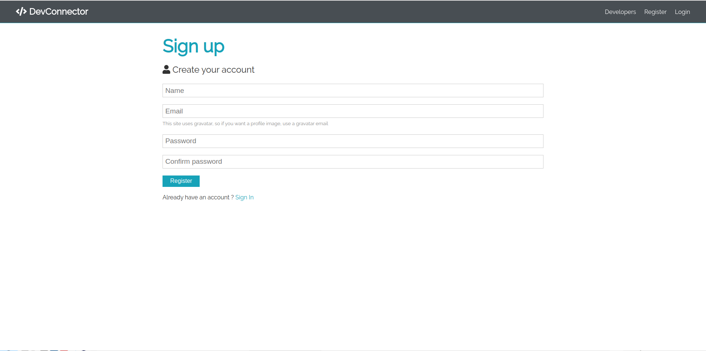
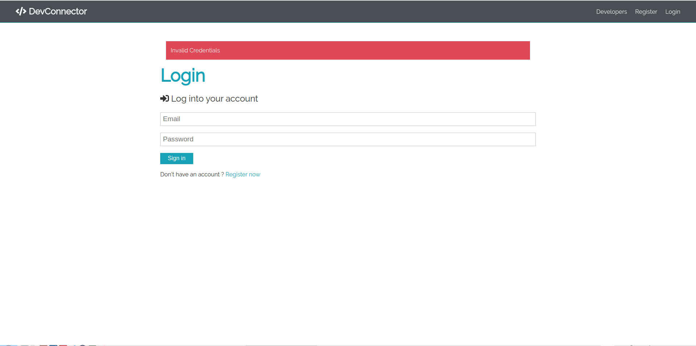
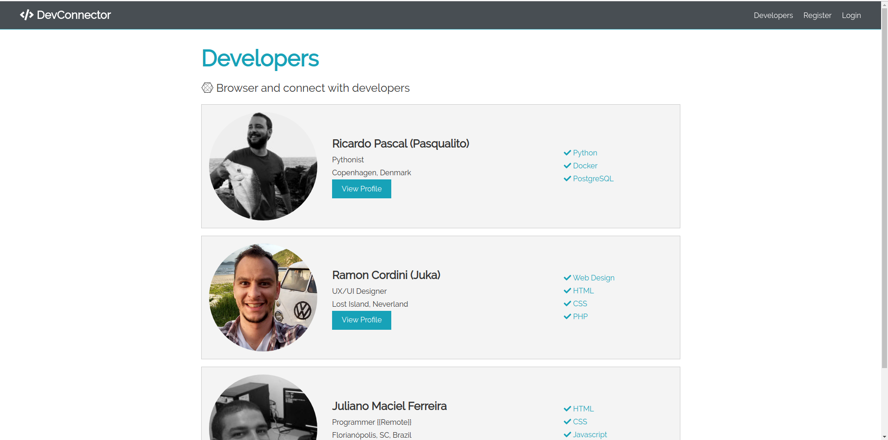

# Social Network Theme

This is a website template based on the tutorial [Social Network Theme With Sass](https://www.youtube.com/playlist?list=PLillGF-Rfqba3xeEvDzIcUCxwMlGiewfV) from Traversy Media&trade;.

The icons are from the Font Awesome&trade; [https://fontawesome.com/](https://fontawesome.com/) library.

The images were downloaded from Pexels™ [https://www.pexels.com/](https://www.pexels.com/) - The best free stock photos & videos shared by talented creators.

## Install Dependencies

**1. Check if you have a recent version of [Node.js](https://nodejs.org/) (which comes bundled with [npm](https://www.npmjs.com/), a JavaScript package manager):**

```bash
$ node -v
```

```bash
$ npm -v
```

**2. In the _project root directory_ install all the dependencies and libs:**

```bash
$ npm install
```

## Start webpack-dev-server

**1. Run the following command:**

```bash
$ npm run start
```

**Or to generate all the bundle:**

```bash
$ npm run build
```

The files will be created in the folder **/dist**.

**2. And then access [http://localhost:8080/](http://localhost:8080/) on your browser (it's setup to open automatically).**

# Screenshots






# Disclaimer

I coded this website template only for the purpose of learning and enhancing my skillset. 

**Access [Traversy Media&trade;](https://www.traversymedia.com/) to learn too.**

# Become a Patron of Traversy Media&trade;

Brad Traversy spends most of his time making free educational videos on YouTube to share with the world. 

Join his Patreon to show your support and gratitude. Even $1 per month means the world.

[https://www.patreon.com/traversymedia](https://www.patreon.com/traversymedia)

# References

- Traversy Media&trade; youtube channel: [https://www.youtube.com/channel/UC29ju8bIPH5as8OGnQzwJyA](https://www.youtube.com/channel/UC29ju8bIPH5as8OGnQzwJyA)

- Traversy Media&trade;: [https://www.traversymedia.com/](https://www.traversymedia.com/)

- Font Awesome&trade;: [https://fontawesome.com/](https://fontawesome.com/)

- Pexels&trade;: [https://www.pexels.com/](https://www.pexels.com/)

- Sass&trade;: [https://sass-lang.com/](https://sass-lang.com/)

- Webpack&trade;: [https://webpack.js.org/](https://webpack.js.org/)

# License

Please see the [license agreement](https://github.com/julianomacielferreira/social-network-theme/blob/master/LICENSE).
